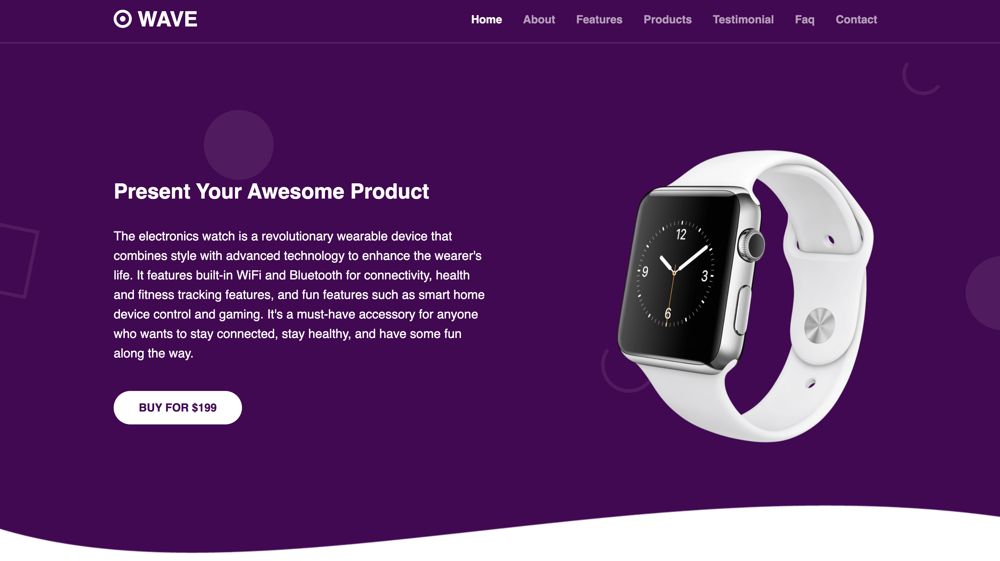

# Wave Wears: Elevate Your Style With Wave.

Wave Wears introduces the future of timekeeping, where style intertwines effortlessly with advanced technology to redefine your daily experience. Explore our innovative platform, crafted with the latest web technologies including HTML5, CSS3, JavaScript (jQuery), and Bootstrap, ensuring a seamless user experience like never before.

  

# Getting started 

To use Wave Wears follow these simple steps:
1. Clone the Wave Wears repository from GitHub
2. Git clone: https://github.com/bahumuhawa/wave_wears.git
3. Open the index.html file in your preferred web browser.
